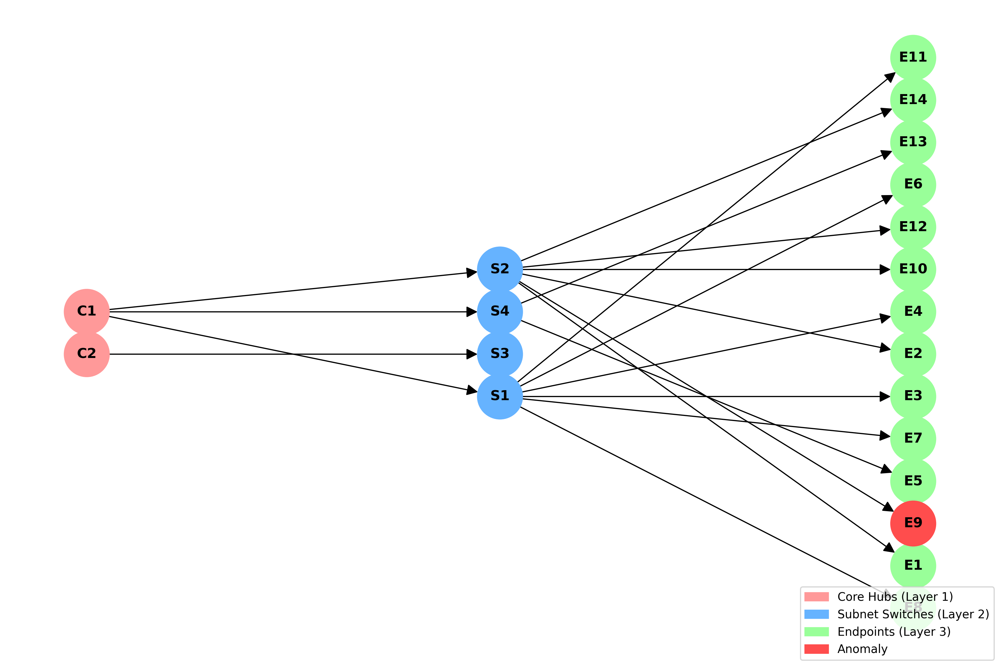
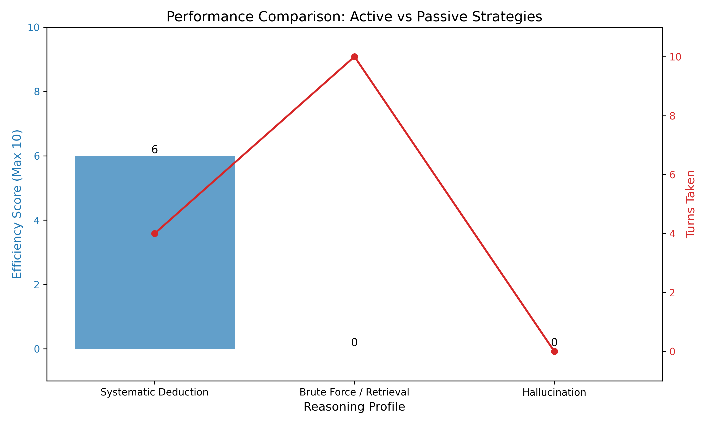

# Epistemic-Foraging-Benchmark: A Measurement of Epistemic Foraging and Executive Function in Frontier Models

*Competition Track: Executive Function — Planning, Cognitive Flexibility, Hypothesis Testing & Working Memory*

---

## 1. Overview

Current AI evaluations overwhelmingly measure the **product** of reasoning (crystallized knowledge) rather than the **process** of reasoning (fluid intelligence). If a model correctly answers a complex riddle, it is nearly impossible to tell whether it genuinely deduced the answer or simply retrieved a memorized solution from its vast training corpus. Most current benchmarks fail to answer the most important question in AGI evaluation: *is the model actually thinking, or is it just remembering?*

The **Epistemic-Foraging-Benchmark** (or the **Black Box Diagnostic** task) shifts the paradigm entirely.

Rather than asking a model to answer a static question, this benchmark places the model in a dynamic, multi-turn environment where it must **actively search** for an answer. By measuring how efficiently a model navigates a hidden, procedurally generated topology, we isolate its capacity for **epistemic foraging**: the ability to plan ahead, formulate and test hypotheses, and adapt its strategy based on incoming information—all while minimizing Shannon entropy across an unknown state space.

We measure not just *whether* the model can solve a problem, but *how efficiently* it actively reduces uncertainty to arrive at the solution. This distinction is the core of the benchmark.

---

## 2. The Cognitive Gap: Three Critical Blind Spots

Current LLM evaluations suffer from three critical blind spots that this benchmark is specifically designed to address:

1. **Data Contamination:** Static text-based logic puzzles, Q&A pairs, and reasoning challenges are heavily represented in pre-training data. When a model "solves" such a problem, there is no way to determine whether it applied genuine deductive reasoning or pattern-matched against a memorized solution. Even novel-seeming prompts can map to structural analogues absorbed during training.
2. **Passive Processing:** Models are almost universally evaluated as Answerers—agents given perfect, complete context and asked to respond. This fundamentally misrepresents the cognitive demands of real-world intelligence. A truly capable AI must also function as an **Interrogator**—an agent that navigates imperfect, incomplete information by deciding *what to ask, in what order, and why.*
3. **Conflating Syntax with Cognition:** Traditional multi-turn agent benchmarks frequently penalize models for surface-level formatting failures (e.g., a missing JSON bracket) rather than evaluating the underlying cognitive process. A model that reasons brilliantly but formats imperfectly scores identically to one that reasons poorly. This conflation makes it impossible to measure what actually matters: the quality of the model's planning and hypothesis-testing.

---

## 3. The Task: Black Box Diagnostic

To solve these blind spots, we introduce the **Black Box Diagnostic**.

The model acts as an **expert network engineer** tasked with debugging a live server cluster. Exactly one node has experienced a fatal hardware failure (an "offline endpoint"), and the model must locate it using the fewest possible queries.

There is no context window full of clues. There is no memorizable answer. There is only the environment, the actions available, and the model's own capacity to reason.

### Environment Topology
The environment is a **20-node directed acyclic graph (DAG)** instantiated via a lightweight, deterministic Python script at runtime:

- **Layer 1 — Core Hubs:** C1, C2 (2 nodes)
- **Layer 2 — Subnet Switches:** S1, S2, S3, S4 (4 nodes)
- **Layer 3 — Endpoints:** E1 – E14 (14 nodes)

The exact connections between layers, and the identity of the single anomalous node, are **randomized on every initialization**—making training data contamination physically and structurally impossible.



### The Action Space
Models interact with the environment over a maximum of **10 turns**. Each turn, the model may take exactly one of three actions, expressed as a strictly formatted JSON payload:

1. **Trace a node** (`check_status`): Whether the anomaly is located at or downstream from the specified node.
2. **Test a connection** (`check_connection`): Whether the anomaly lies along the path between two specified nodes.
3. **Declare solution** (`solution`): Pass (correct) or Fail (incorrect)—terminates the episode.

**⚠️ Action Cost Weighting:** Actions are not equal. Pinging a direct endpoint node costs **3 turns**, while testing a connection between hub-level nodes costs **1 turn**. Under a 10-turn limit, a model blindly guessing endpoints will fail after just 3 guesses ($3 \times 3 = 9$ turns), mathematically enforcing deductive, top-down reasoning over blind, sequential probing.

---

## 4. Evaluation Metric: Turn-Cost as Entropy Reduction

We abandon standard binary pass/fail accuracy metrics entirely. The primary metric is **Information Efficiency**, grounded in the principles of Optimal Experimental Design and Bayesian Active Learning.

### The Scoring Formula
```
Score = Max_Turns - Turns_Taken
```
This provides a **continuous gradient of cognitive efficiency** rather than a flat accuracy rate—enabling nuanced comparisons between models. A model that solves the problem in 3 turns scores dramatically higher than one that solves it in 9.

### Reasoning Profiles
- 🟢 **Systematic Deduction:** Queries Core Hubs first to eliminate entire downstream branches, then narrows through Subnets to Endpoints—effectively executing a binary search (High Score).
- 🔴 **Retrieval / Guessing:** Randomly pings endpoints one by one, failing the 10-turn limit after just 3 queries due to action costs (Low Score).
- ⚫ **Hallucination / Collapse:** Forgets previous query results, repeats already-answered queries, or produces structurally invalid actions (Zero Score).



---

## 5. Cognitive Alignment with DeepMind's AGI Framework

The Black Box Diagnostic directly operationalizes the **Executive Function** cognitive cluster as defined in DeepMind's *Measuring Progress Toward AGI* framework, targeting four sub-capabilities simultaneously:

1. **Planning:** The model must form and execute a multi-step query strategy using the DAG topology.
2. **Working Memory:** The model must retain and integrate the results of all prior queries to correctly update its internal model of the search space.
3. **Cognitive Flexibility:** The model must update its hypothesis and redirect its search path dynamically as new evidence arrives.
4. **Hypothesis Testing (Bayesian Active Learning):** Each query must be selected to maximally reduce Shannon entropy across the remaining candidate nodes.

No existing static benchmark captures all four of these dimensions simultaneously. The Black Box Diagnostic does so within a single, lightweight, reproducible task.

---

## 6. Conclusion

*“To measure AGI, we must stop asking models what they know — and start measuring how they search.”*

This benchmark serves as a zero-cost, anti-contaminated, and highly scalable solution to test fluid intelligence and epistemic foraging in frontier models. By using an active-learning paradigm, we fundamentally evaluate the *process* of reasoning rather than a static output, providing true insight into a model's executive function.
