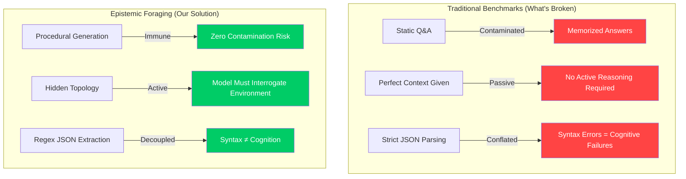
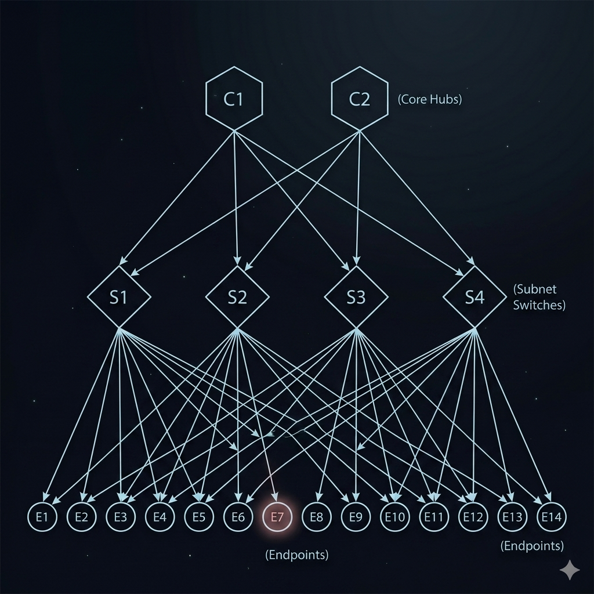
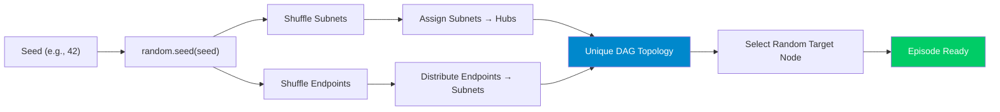
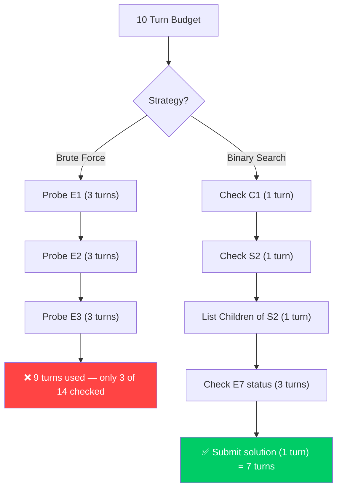
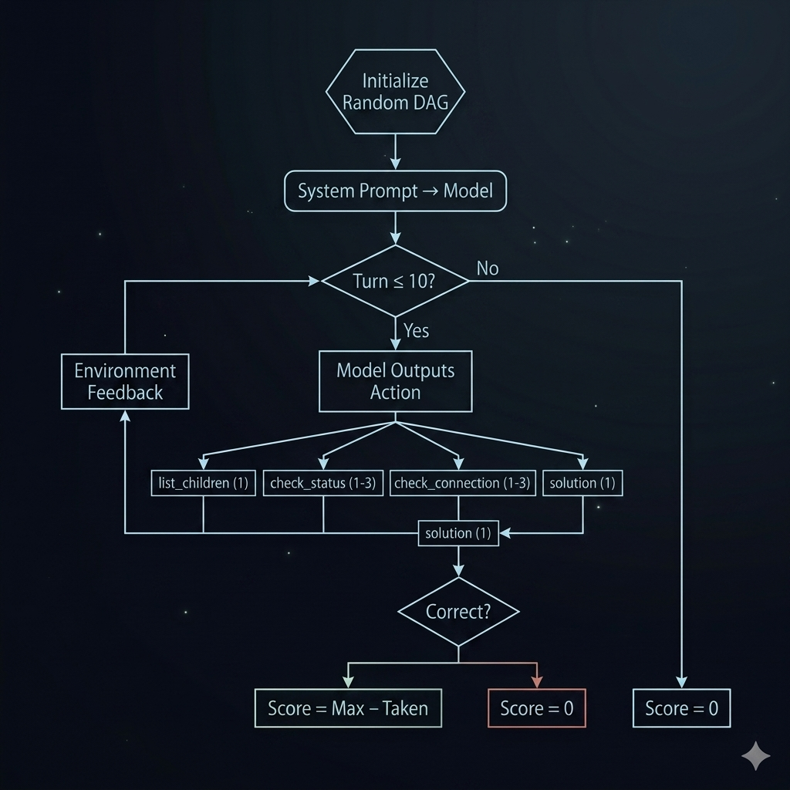
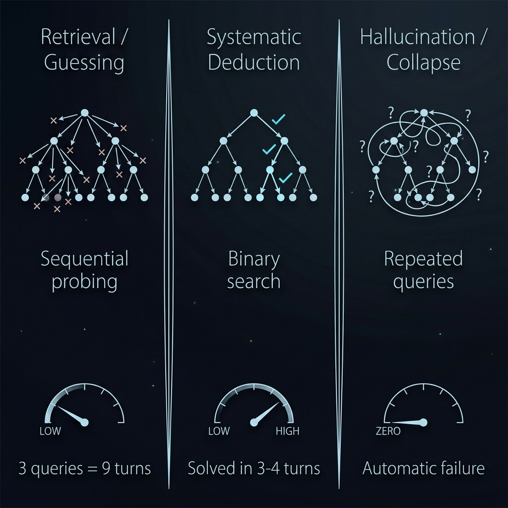
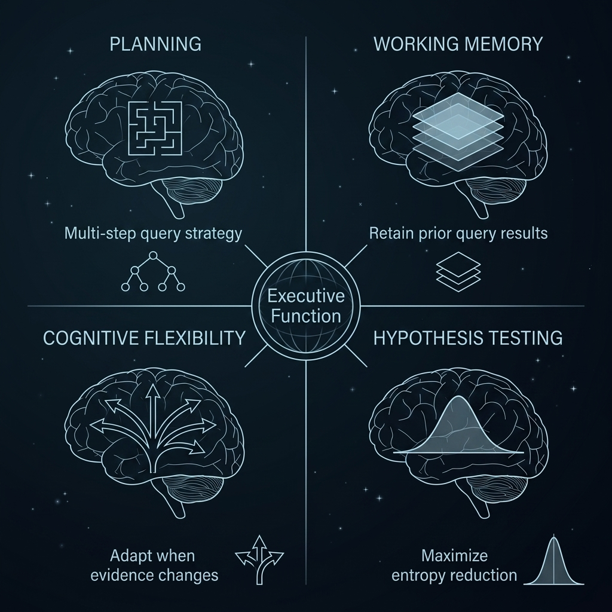
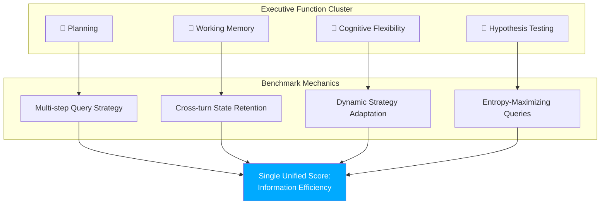
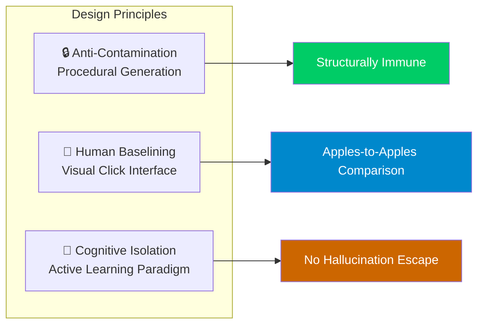

# 🧠 Epistemic Foraging Efficiency Benchmark

## A Detailed Writeup for: *Kaggle — Measuring Progress Toward AGI (Cognitive Abilities)*

> **Competition Track:** Executive Function — Planning, Cognitive Flexibility, Hypothesis Testing & Working Memory
>
> **Competition URL:** [kaggle.com/competitions/kaggle-measuring-agi](https://www.kaggle.com/competitions/kaggle-measuring-agi)


---

## Table of Contents

1. [Competition Overview](#1-competition-overview)
2. [The Problem: Why Current Benchmarks Fail](#2-the-problem-why-current-benchmarks-fail)
3. [Our Solution: The Black Box Diagnostic](#3-our-solution-the-black-box-diagnostic)
4. [Environment Architecture](#4-environment-architecture)
5. [Action Space & Turn Economy](#5-action-space--turn-economy)
6. [Evaluation Loop](#6-evaluation-loop)
7. [Scoring: Information Efficiency](#7-scoring-information-efficiency)
8. [Reasoning Profiles](#8-reasoning-profiles)
9. [Cognitive Alignment with DeepMind's AGI Framework](#9-cognitive-alignment-with-deepminds-agi-framework)
10. [SDK Implementation](#10-sdk-implementation)
11. [Preliminary Results](#11-preliminary-results)
12. [Key Design Principles](#12-key-design-principles)
13. [Conclusion](#13-conclusion)

---

## 1. Competition Overview

The **Kaggle "Measuring Progress Toward AGI — Cognitive Abilities"** competition, co-hosted with **Google DeepMind**, challenges participants to design high-quality benchmarks that go *beyond recall* to evaluate how frontier AI models truly **reason**, **act**, and **judge**.

This is not a standard model competition — participants are not training or fine-tuning models. Instead, participants are designing **evaluation instruments** that probe the cognitive capabilities of frontier AI systems. The competition seeks benchmarks that can reliably distinguish between models that genuinely *think* and models that merely *remember*.

> [!IMPORTANT]
> **Goal:** Design a novel, reproducible benchmark that evaluates frontier models on cognitive abilities — specifically targeting areas where current evaluations are weakest: active reasoning, hypothesis testing, planning under uncertainty, and cognitive flexibility.

### Competition Requirements

| Requirement | Details |
|---|---|
| **Track** | Cognitive Abilities (Executive Functions) |
| **Submission** | Kaggle Notebook using `kaggle-benchmarks` SDK |
| **Cost** | $0 external API calls required |
| **Data** | No proprietary datasets allowed |
| **Evaluation** | Benchmarks are judged on novelty, rigor, contamination-resistance, and alignment with DeepMind's AGI framework |
| **Human Baselines** | Must be feasible to collect human comparison data |
| **License** | Open-source (CC0 1.0 Universal) |

---

## 2. The Problem: Why Current Benchmarks Fail

Current LLM evaluations overwhelmingly measure the **product** of reasoning (crystallized knowledge) rather than the **process** of reasoning (fluid intelligence). If a model correctly answers a complex riddle, it is nearly impossible to tell whether it genuinely *deduced* the answer or simply *retrieved* a memorized solution from its vast training corpus.

Our benchmark identifies and addresses **three critical blind spots** in existing AI evaluation:

### 2.1 Data Contamination

Static text-based logic puzzles, Q&A pairs, and reasoning challenges are heavily represented in pre-training data. When a model "solves" such a problem, there is no way to determine whether it applied genuine deductive reasoning or pattern-matched against a memorized solution. Even novel-seeming prompts can map to structural analogues absorbed during training.

### 2.2 Passive Processing

Models are almost universally evaluated as **Answerers** — agents given perfect, complete context and asked to respond. This fundamentally misrepresents the cognitive demands of real-world intelligence. A truly capable AI must also function as an **Interrogator** — an agent that navigates imperfect, incomplete information by deciding *what to ask*, *in what order*, and *why*.

### 2.3 Conflating Syntax with Cognition

Traditional multi-turn agent benchmarks frequently penalize models for surface-level formatting failures — a missing JSON bracket, an incorrectly escaped string — rather than evaluating the underlying cognitive process. A model that reasons brilliantly but formats imperfectly scores identically to one that reasons poorly.



---

## 3. Our Solution: The Black Box Diagnostic

**The Interrogator's Dilemma** — executed via the **Black Box Diagnostic** task — shifts the paradigm entirely.

Rather than asking a model to *answer* a static question, this benchmark places the model in a dynamic, multi-turn environment where it must **actively search** for an answer. The model acts as an **expert network engineer** tasked with debugging a live server cluster. Exactly one node has experienced a fatal hardware failure — an "offline endpoint" — and the model must locate it using the fewest possible queries.

> There is no context window full of clues. There is no memorizable answer. There is only the environment, the actions available, and the model's own capacity to reason.

We measure not just *whether* the model can solve a problem, but *how efficiently* it actively reduces uncertainty to arrive at the solution. This distinction is the entire benchmark.

---

## 4. Environment Architecture

The environment is a **20-node directed acyclic graph (DAG)**, instantiated via a lightweight, deterministic Python script at runtime upon each evaluation.



### 4.1 Network Layers

The DAG is organized into three hierarchical layers:

```
Layer 1 — Core Hubs       :  C1, C2           (2 nodes)
Layer 2 — Subnet Switches :  S1, S2, S3, S4   (4 nodes)
Layer 3 — Endpoints       :  E1 – E14         (14 nodes)
─────────────────────────────────────────────────────────
                              Total: 20 nodes
```

| Layer | Nodes | Role | Count |
|---|---|---|---|
| **Core Hubs** | C1, C2 | Central routing nodes — root of the topology tree | 2 |
| **Subnet Switches** | S1–S4 | Intermediate routing — each connects to a Core Hub | 4 |
| **Endpoints** | E1–E14 | Leaf nodes — one of these is the anomalous (offline) node | 14 |

### 4.2 Randomization Protocol

The exact connections between layers, and the identity of the single anomalous node, are **randomized on every initialization** via seed-controlled `random` calls:

1. **Hub → Subnet mapping** is shuffled (each hub guaranteed ≥ 1 subnet)
2. **Subnet → Endpoint distribution** is randomized across all 4 subnets
3. **Target node** is randomly selected from the 14 endpoints

This makes training data contamination **physically and structurally impossible** — no static dataset exists that could contain the answer.



---

## 5. Action Space & Turn Economy

Models interact with the environment over a maximum of **10 turns**. Each turn, the model may take exactly one of four actions, expressed as a JSON payload.

> [!TIP]
> Chain-of-thought reasoning is **explicitly decoupled from action execution** via regex parsing (`re.search(r'\{.*?\}', response_text, re.DOTALL)`). The model is free to reason at length in natural language before outputting its action — it is evaluated exclusively on its spatial reasoning and planning efficiency, not on perfect JSON formatting.

### 5.1 Action Table

| # | Action | JSON Payload | Environment Returns | Turn Cost |
|---|--------|-------------|---|---|
| 1 | **Discover topology** | `{"query_type": "list_children", "target": "Node_Name"}` | Direct children of the specified node | **1 turn** |
| 2 | **Trace a node** | `{"query_type": "check_status", "target": "Node_Name"}` | Whether the anomaly is at or downstream from the node | **1 turn** (hubs/subnets) / **3 turns** (endpoints) |
| 3 | **Test a connection** | `{"query_type": "check_connection", "target_1": "A", "target_2": "B"}` | Whether the anomaly lies along the path between nodes | **1 turn** (hubs/subnets) / **3 turns** (if endpoint involved) |
| 4 | **Declare solution** | `{"solution": "Node_Name"}` | Pass (correct) or Fail (incorrect) — terminates episode | **1 turn** |

### 5.2 Action Cost Mathematics

> [!WARNING]
> **Actions are not equal.** To prevent brute-force execution, actions involving endpoint nodes carry a **3× turn cost**. Under a 10-turn limit, a model blindly guessing endpoints will fail after just 3 guesses:
>
> $$3 \text{ guesses} \times 3 \text{ turns each} = 9 \text{ turns consumed}$$
>
> This mathematically enforces **deductive, top-down reasoning** over blind, sequential probing.



---

## 6. Evaluation Loop

The benchmark runs as a **multi-turn conversational loop** using the `kaggle-benchmarks` SDK. Here is the complete evaluation flow:



### 6.1 Episode Lifecycle

```
┌─────────────────────────────────────────────────────────────┐
│ EPISODE START                                                │
│                                                              │
│  1. generate_random_topology(seed)  → Hidden DAG created     │
│  2. System prompt sent to model     → No topology revealed   │
│  3. Model outputs action (JSON)     → Regex-extracted         │
│  4. Environment returns feedback    → Observation only        │
│  5. Repeat 3-4 until:                                        │
│     • Solution submitted (correct or incorrect)              │
│     • 10-turn limit reached                                  │
│  6. Score computed: Max_Turns - Turns_Taken (if correct)     │
│                                                              │
│ EPISODE END                                                  │
└─────────────────────────────────────────────────────────────┘
```

### 6.2 State Management

| Component | Implementation |
|---|---|
| **Graph State** | Python dictionary tracking the live DAG configuration |
| **Query History** | Full conversation context appended each turn |
| **Turn Counter** | Monotonically increasing, weighted by action cost |
| **Action Parser** | `re.search(r'\{.*?\}', response_text, re.DOTALL)` — syntax-tolerant |

---

## 7. Scoring: Information Efficiency

We abandon standard binary pass/fail accuracy metrics entirely. The primary metric is **Information Efficiency**, grounded in the principles of **Optimal Experimental Design** and **Bayesian Active Learning**.

### 7.1 The Scoring Formula

```
Score = Max_Turns - Turns_Taken + 1    (if solved correctly)
Score = 0                               (if incorrect or timeout)
```

This provides a **continuous gradient of cognitive efficiency** rather than a flat accuracy rate — enabling nuanced comparisons between models, across difficulty seeds, and against human baselines.

| Turns Taken | Score | Interpretation |
|---|---|---|
| 3 | **8** | Exceptional — near-optimal binary search |
| 4 | **7** | Excellent — efficient deductive strategy |
| 5 | **6** | Good — solid hypothesis testing |
| 7 | **4** | Average — some wasted queries |
| 9 | **2** | Poor — borderline brute-force |
| 10 | **1** | Minimal — solved at the last possible turn |
| Timeout/Wrong | **0** | Failure — no cognitive signal |

> [!NOTE]
> The maximum possible score per episode is **10** (solved in 1 turn, which would require pure luck). The practical ceiling for systematic deduction is **7–8** (solved in 3–4 turns). Across 200 episodes, the aggregate mean provides a robust, statistically significant cognitive efficiency metric.

---

## 8. Reasoning Profiles

The benchmark naturally classifies models into three distinct **reasoning profiles** — each representing a fundamentally different cognitive architecture:



### 8.1 Profile Breakdown

````carousel
### 🔴 Retrieval / Guessing
**Behavior:** Randomly pings endpoints one by one (E1, then E2, then E3...).

**Why It Fails:** Each endpoint probe costs 3 turns. After just 3 guesses, the model has consumed 9 of its 10 turns — having checked only 3 of 14 possible endpoints (21% coverage).

**Cognitive Interpretation:** The model is applying a brute-force strategy equivalent to "poor executive function" — it cannot recognize the hierarchical structure of the problem or plan an efficient search strategy.

**Expected Score:** 0–2 (near-total failure)
<!-- slide -->
### 🟢 Systematic Deduction
**Behavior:** Queries Core Hubs first to eliminate entire downstream branches, then narrows through Subnets to Endpoints — effectively executing a binary search.

**Optimal Strategy:**
1. `list_children` of C1 → discover which subnets are under C1 (1 turn)
2. `check_status` of C1 → is anomaly downstream? (1 turn)
3. `check_status` of relevant subnet (1 turn)
4. `list_children` of that subnet → discover endpoints (1 turn)
5. `check_status` of one endpoint → narrow further (3 turns)
6. Submit solution (1 turn)

**Expected Score:** 6–8 (high cognitive efficiency)
<!-- slide -->
### ⚫ Hallucination / Collapse
**Behavior:** Forgets previous query results, repeats already-answered queries, produces structurally invalid actions, or submits solutions without supporting evidence.

**Why It's Revealing:** This profile exposes fundamental **working memory** failures — the model cannot integrate and retain information across turns of a multi-step interaction.

**Expected Score:** 0 (automatic failure)
````

---

## 9. Cognitive Alignment with DeepMind's AGI Framework

The Black Box Diagnostic directly operationalizes the **Executive Function** cognitive cluster as defined in DeepMind's *Measuring Progress Toward AGI* framework, targeting **four sub-capabilities simultaneously**:



| Cognitive Capability | How This Benchmark Measures It | Observable Signal |
|---|---|---|
| **Planning** | The model must form and execute a multi-step query strategy using the DAG topology — it cannot solve the problem reactively turn by turn | Does the model query hubs before endpoints? |
| **Working Memory** | The model must retain and integrate the results of all prior queries to correctly update its internal model of the search space | Does the model repeat queries it already has answers for? |
| **Cognitive Flexibility** | The model must update its hypothesis and redirect its search path dynamically as new evidence arrives | Does the model adapt when C1 returns "nominal"? |
| **Hypothesis Testing** | Each query must be selected to maximally reduce Shannon entropy across the remaining candidate nodes | Does the model choose maximally informative queries? |

> [!IMPORTANT]
> **No existing static benchmark captures all four of these dimensions simultaneously.** The Black Box Diagnostic does so within a single, lightweight, reproducible task — requiring $0 in API costs and no proprietary datasets.



---

## 10. SDK Implementation

This benchmark is built natively on top of the **`kaggle-benchmarks` multi-turn conversation loop** and requires no external infrastructure.

### 10.1 Technical Stack

| Component | Implementation Detail |
|---|---|
| **Graph Generation** | 20-node DAG instantiated via `generate_random_topology(seed)` |
| **State Tracking** | Python dictionary maintains the active DAG + query history |
| **Turn Limit** | 10 turns maximum per episode |
| **Episodes** | 200 fully randomized, seed-controlled episodes |
| **Action Parser** | `re.search(r'\{.*?\}', response_text, re.DOTALL)` — syntax-decoupled |
| **Scoring** | `Max_Turns - Turns_Taken + 1`, computed at episode termination |
| **Action Weighting** | Endpoint probes cost 3 turns; hub/subnet probes cost 1 turn |
| **SDK Integration** | Native `kaggle-benchmarks` multi-turn loop via `@kbench.task` decorator |
| **External Dependencies** | None — $0 in API calls, no proprietary data |
| **License** | CC0 1.0 Universal |

### 10.2 Core Code Architecture

```python
# Task definition using Kaggle Benchmarks SDK
@kbench.task(name="epistemic_foraging_efficiency")
def epistemic_foraging_task(llm, target_node, scenario_type, seed) -> float:
    
    # 1. Hidden topology generated fresh per episode
    current_topology = generate_random_topology(seed)
    
    # 2. Multi-turn interaction loop
    with kbench.chats.new("foraging_chat"):
        while turns_taken < MAX_TURNS:
            response_text = llm.prompt(history_context)
            action = parse_model_action(response_text)  # Regex-based extraction
            
            # 3. Route to appropriate handler
            if action.get("query_type") == "list_children":     # cost: 1
                feedback = list_children(target, topology)
            elif action.get("query_type") == "check_status":    # cost: 1 or 3
                feedback = check_downstream_status(target, ...)
            elif action.get("query_type") == "check_connection": # cost: 1 or 3
                feedback = check_path_status(t1, t2, ...)
            elif "solution" in action:                           # cost: 1
                solved = (guess == target_node)
                break
    
    # 4. Continuous scoring
    return float(MAX_TURNS - turns_taken + 1) if solved else 0.0
```

---

## 11. Preliminary Results

Initial evaluation using **Gemini 3 Flash (Preview)** across 5 pilot episodes:

| Episode | Target | Seed | Turns | Outcome | Score |
|---|---|---|---|---|---|
| Run #1 | E11 | 100 | 8 | ❌ Incorrect guess (E13) | 0.0 |
| Run #2 | E2 | 101 | 10+ | ❌ Exceeded turn limit | 0.0 |
| Run #3 | E1 | 102 | 8 | ✅ Solved correctly | 3.0 |
| Run #4 | E12 | 103 | 9 | ❌ Incorrect guess (E5) | 0.0 |
| Run #5 | E5 | 104 | 9 | ✅ Solved correctly | 2.0 |

### Key Observations

- **40% solve rate** (2/5 correct) — the benchmark is genuinely challenging
- Even successful episodes averaged **8.5 turns** — far from the optimal 3–4 turns
- The model demonstrated partial planning (queried hubs before endpoints) but exhibited **working memory degradation** in later turns
- Incorrect guesses often occurred when the model had sufficient information to deduce the answer but failed to integrate all available evidence

> [!NOTE]
> These preliminary results use only 5 episodes for rapid validation. The production benchmark runs **200 episodes** for statistical robustness.

---

## 12. Key Design Principles

### A. Zero-Cost Procedural Generation (Anti-Contamination)

The network topology and anomalous node are randomized at runtime. Because the environment is generated fresh per evaluation, no static artifact exists in any training corpus. This makes the benchmark **structurally immune** to data contamination — not merely improbable, but physically impossible.

### B. Scalable Human Baselining

The Black Box Diagnostic translates seamlessly into a simple, language-agnostic visual web interface: a rendered tree of clickable nodes. A human participant needs no technical background — they click nodes to find the broken server. This allows researchers to crowdsource **thousands of human baseline interactions at minimal cost**, tracking human *click-efficiency* directly against LLM *turn-efficiency* using an identical metric.

### C. Isolating Executive Function from Helpfulness Training

Standard RLHF fine-tuning optimizes for "helpfulness" — producing confident, fluent, plausible-sounding responses. By utilizing an **active-learning paradigm**, the Black Box Diagnostic structurally eliminates this failure mode. The model cannot hallucinate a polite, confident answer — it is **mathematically forced** to prove its causal reasoning against a stateful environment that responds only to correct queries.



---

## 13. Conclusion

The **Epistemic Foraging Efficiency Benchmark** reframes AI evaluation from a question of *what does the model know?* to *how does the model search?*

By forcing frontier models into a dynamic, multi-turn environment with hidden topology, weighted action costs, and a continuous scoring gradient, we isolate the cognitive capabilities that matter most for progress toward AGI:

- **Planning** under uncertainty
- **Working Memory** across extended interactions
- **Cognitive Flexibility** in response to new evidence
- **Hypothesis Testing** via Bayesian-optimal query selection

The benchmark is:

- ✅ **$0 cost** — no external APIs, no proprietary data
- ✅ **Contamination-immune** — procedurally generated at runtime
- ✅ **Human-comparable** — identical metric for humans and models
- ✅ **SDK-native** — single notebook submission via `kaggle-benchmarks`
- ✅ **Open source** — CC0 1.0 Universal license

---

> *"To measure AGI, we must stop asking models what they know — and start measuring how they search."*

---

**Repository:** [Epistemic-Foraging-Benchmark](https://github.com/chandan989/Epistemic-Foraging-Benchmark)
**License:** [CC0 1.0 Universal](https://creativecommons.org/publicdomain/zero/1.0/)
